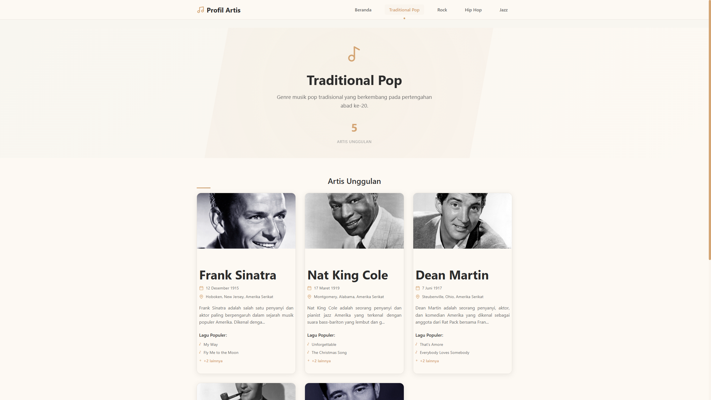

# 🎵 Artist Profile Modern

A modern, responsive React.js website showcasing legendary music artists across different genres. Built with Vite, featuring a clean white cream design theme and smooth animations.



## ✨ Features

- **Modern UI/UX**: Clean, cream-colored design with smooth animations
- **Responsive Design**: Optimized for all device sizes
- **Multiple Genres**: Traditional Pop, Rock, Hip Hop, and Jazz
- **Artist Profiles**: Detailed information about legendary musicians
- **Interactive Navigation**: Smooth page transitions and hover effects
- **Animation**: Powered by Framer Motion for delightful user experience
- **Professional Footer**: Copyright information with branded styling

## 🛠️ Technologies Used

- **React.js** - Frontend framework
- **Vite** - Build tool and development server
- **React Router** - Client-side routing
- **Framer Motion** - Animation library
- **Lucide React** - Beautiful icons
- **CSS3** - Styling with custom properties and modern features

## 🎨 Design

- **Color Palette**: White cream theme (#F8F6F0, #FDF9F3, #FAF5EE)
- **Accent Colors**: Gold (#D4A574, #C69C6D)
- **Typography**: Inter font family with clean, readable text
- **Animations**: Subtle hover effects, fade-ins, and smooth transitions

## 🚀 Getting Started

### Prerequisites

- Node.js (version 16 or higher)
- npm or yarn

### Installation

1. Clone the repository
2. Install dependencies:

   ```bash
   npm install
   ```

3. Start the development server:

   ```bash
   npm run dev
   ```

4. Open your browser and navigate to `http://localhost:5173`

## 📁 Project Structure

```
src/
├── components/
│   ├── Navigation.jsx
│   └── Navigation.css
├── pages/
│   ├── Home.jsx
│   ├── Home.css
│   ├── GenrePage.jsx
│   ├── GenrePage.css
│   ├── ArtistDetail.jsx
│   └── ArtistDetail.css
├── data/
│   └── artistsData.js
├── App.jsx
├── App.css
├── index.css
└── main.jsx
```

## 🎭 Artists Featured

### Traditional Pop

- Frank Sinatra
- Nat King Cole
- Dean Martin
- Bing Crosby
- Tony Bennett

### Rock

- Elvis Presley
- The Beatles
- Led Zeppelin
- Queen
- The Rolling Stones

### Hip Hop

- Tupac Shakur
- The Notorious B.I.G.
- Jay-Z
- Eminem
- Dr. Dre

### Jazz

- Louis Armstrong
- Duke Ellington
- Miles Davis
- John Coltrane
- Billie Holiday

## 🎯 Available Scripts

- `npm run dev` - Start development server
- `npm run build` - Build for production
- `npm run preview` - Preview production build
- `npm run lint` - Run ESLint

## 🌟 Key Features

- **Smooth Animations**: Page transitions and hover effects
- **Mobile-First Design**: Responsive across all devices
- **Fast Loading**: Optimized with Vite build tool
- **Accessibility**: Proper semantic HTML and ARIA labels
- **SEO Friendly**: Proper meta tags and structure

## 🔧 Customization

You can easily customize the website by:

- Modifying the color palette in `src/index.css`
- Adding new artists in `src/data/artistsData.js`
- Adjusting animations in component files
- Updating the layout and styling in CSS files

## 📱 Responsive Breakpoints

- Mobile: 480px and below
- Tablet: 768px and below
- Desktop: 969px and above

## 🎨 Animation Details

- **Fade-in animations** on page load
- **Hover effects** on cards and buttons
- **Smooth transitions** between pages
- **Floating elements** for visual interest
- **Scale animations** on interactive elements

## 🚀 Performance

- Optimized images and assets
- Lazy loading for better performance
- Minimal bundle size with Vite
- Efficient React components

## 📄 License

This project is for educational purposes.
